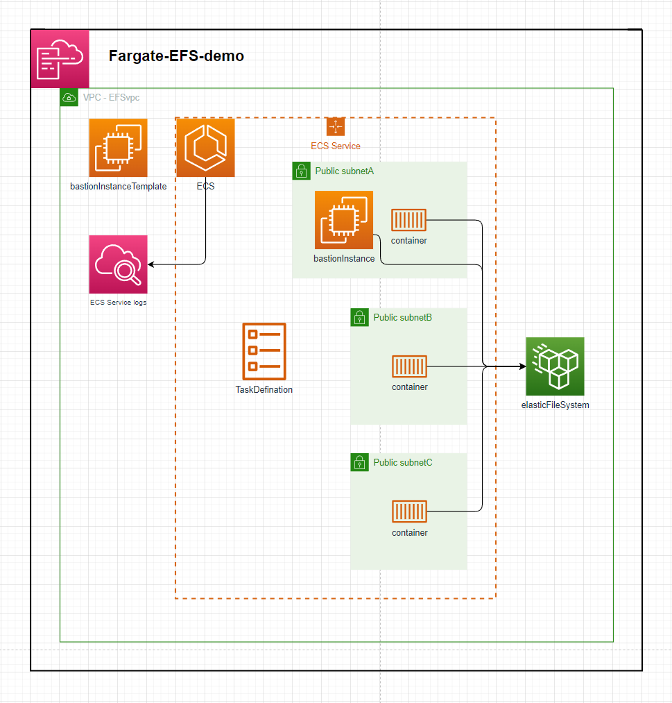
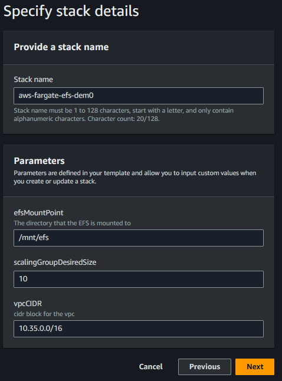
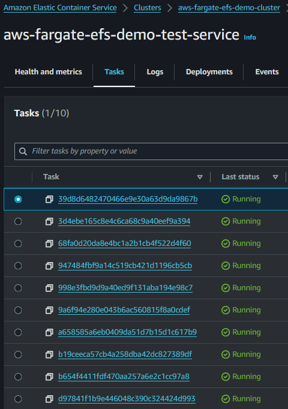
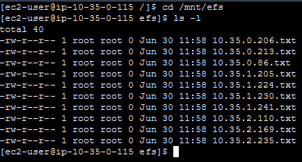

# Fargate-EFS-demo

The template in this repository defines an ECS Service that launches containers backed by an Elastic File Ssytem as a mounted volume

---

# Setup:
1. deploy the template - speficy stack parameters

2. By default this will create a VPC with the default CIDR parameter. The ECS Service will launch 10 instances in the VPC across 3 AZs. Each subnet mounts to the Elastic File System and each container mounts to the `efsMountPoint` directory & touchs a file into that directory.
3. The EC2 bastion instance can be connected to view the mounted directory. E.g. An ECS Service of 10 containers will individually create 1 file each in the mounted directory.

# Example:

#### ECS Service with 10 Tasks

Each Task's container will create a file in the `efsMountPoint` directory

You can connect to the bastion instance to check the files in the mounted directory

